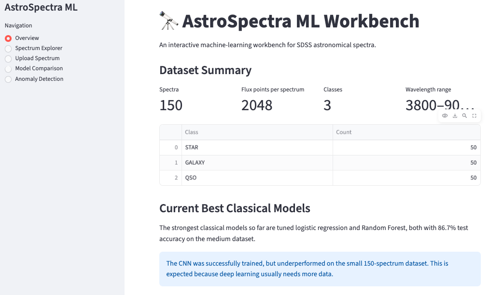
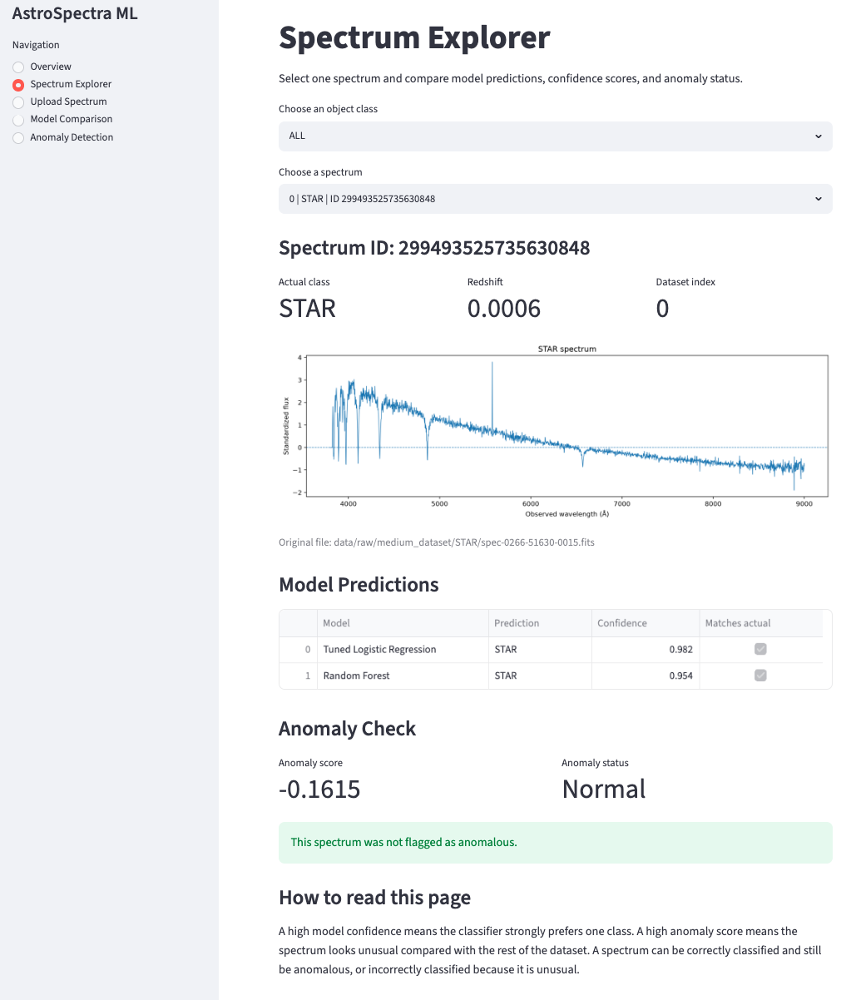
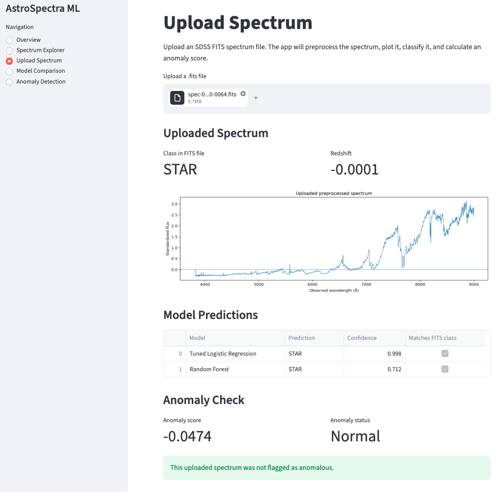
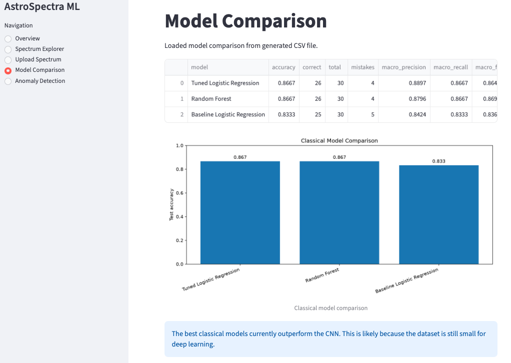
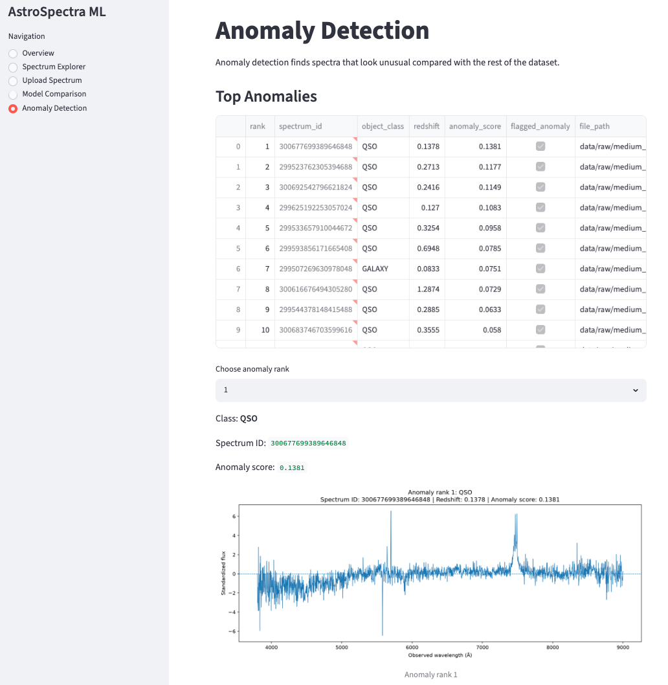

# AstroSpectra ML Workbench


AstroSpectra ML Workbench is an end-to-end machine-learning app for working with astronomical spectra from SDSS.

The project downloads real SDSS spectra, preprocesses them onto a common wavelength grid, trains multiple classifiers, detects unusual spectra, and provides an interactive Streamlit dashboard for exploration and prediction.

## App Preview

### Overview



### Spectrum Explorer



### Upload Spectrum Prediction



### Model Comparison



### Anomaly Detection



## Quick Start

```bash
conda create -n astrospectra-ml python=3.11
conda activate astrospectra-ml
python -m pip install -e ".[dev]"
streamlit run app.py
```

## Why this project matters

Astronomical and astrochemical research increasingly depends on reliable software pipelines for handling observational, simulated, and laboratory datasets. This project demonstrates a reproducible scientific machine-learning workflow for spectra: loading FITS data, preprocessing signals, training and comparing models, detecting unusual spectra, and exposing the workflow through an interactive dashboard.

The goal is not only to build a classifier, but to show how astronomical data science workflows can be made testable, reproducible, and easier for researchers to inspect.

## Research Software and Reproducibility Focus

This project is designed as a small but complete research-software workflow, not only as a machine-learning demo. The emphasis is on making astronomical spectra analysis reproducible, inspectable, and easy to extend.

| Research-software aspect | How it is demonstrated |
|---|---|
| Scientific software engineering | Modular Python package, reusable preprocessing code, scripts, tests, and documented workflows |
| Astronomical data handling | SDSS FITS ingestion with Astropy and spectra from STAR, GALAXY, and QSO classes |
| Machine learning workflow | Logistic regression, hyperparameter tuning, Random Forest, PyTorch 1D CNN, and Isolation Forest anomaly detection |
| Statistical evaluation | Cross-validation, classification reports, confusion matrices, model comparison, and anomaly scoring |
| Reproducibility | Fixed random seeds, manifest files, documented commands, separated raw/processed/model artifacts |
| Research-code maintainability | Clear package structure, CLI-style scripts, pytest tests, `.gitignore`, and GitHub-based version control |
| Interactive scientific inspection | Streamlit dashboard with spectrum explorer, upload prediction, model comparison, and anomaly review |
| Extensibility | The workflow can be extended to larger SDSS samples, simulated spectra, laboratory spectra, or astrochemical datasets |

## What the app does

The app can:

- Explore SDSS spectra for STAR, GALAXY, and QSO objects
- Plot preprocessed flux versus wavelength
- Predict object class using trained ML models
- Compare model confidence scores
- Detect anomalous or unusual spectra
- Upload a new SDSS FITS spectrum and classify it

## Current dataset

The medium dataset contains 150 SDSS spectra:

| Class | Count |
|---|---:|
| STAR | 50 |
| GALAXY | 50 |
| QSO | 50 |

Each spectrum is preprocessed into a fixed-length vector:

```text
2048 standardized flux values
```

The wavelength range used is approximately:

```text
3800–9000 Å
```

## Current model results

All models were evaluated on the same test split of 30 spectra.

| Model | Test Accuracy | Correct / 30 | Mistakes | Macro F1-score |
|---|---:|---:|---:|---:|
| Baseline Logistic Regression | 83.3% | 25 / 30 | 5 | 0.836 |
| Tuned Logistic Regression | 86.7% | 26 / 30 | 4 | 0.864 |
| Random Forest | 86.7% | 26 / 30 | 4 | 0.869 |
| 1D CNN | 73.3% | 22 / 30 | 8 | 0.730 |

The best classical models currently outperform the CNN. This is expected because the dataset is still small for deep learning.

## Key project insight

The anomaly detector found that the most unusual spectra were mostly QSOs.

Among the top 12 anomalies:

```text
11 QSO
1 GALAXY
0 STAR
```

Some of the same QSO spectra were also misclassified by the classifiers. This suggests that unusual QSO spectra are one of the main challenges in the dataset.

## Project structure

```text
astrospectra-ml/
├── app.py
├── astrospectra/
│   ├── __init__.py
│   ├── preprocessing.py
│   └── spectrum.py
├── scripts/
│   ├── download_small_dataset.py
│   ├── build_processed_dataset.py
│   ├── train_baseline_classifier.py
│   ├── download_medium_dataset.py
│   ├── build_medium_dataset.py
│   ├── train_medium_baseline.py
│   ├── tune_medium_baseline.py
│   ├── train_random_forest.py
│   ├── compare_classical_models.py
│   ├── train_cnn_classifier.py
│   ├── detect_anomalies.py
│   └── plot_tuned_mistakes.py
├── data/
│   ├── raw/
│   ├── processed/
│   └── manifests/
├── models/
├── outputs/
├── tests/
├── pyproject.toml
└── README.md
```

Generated data, trained models, and output plots are not committed to GitHub.

## Installation

Create and activate a Conda environment:

```bash
conda create -n astrospectra-ml python=3.11
conda activate astrospectra-ml
```

Install the project dependencies:

```bash
python -m pip install -e ".[dev]"
```

The main dependencies include:

```text
numpy
matplotlib
astropy
astroquery
scikit-learn
torch
streamlit
pandas
pytest
```

## Reproduce the data pipeline

Download the medium dataset:

```bash
python scripts/download_medium_dataset.py
```

Build the processed machine-learning dataset:

```bash
python scripts/build_medium_dataset.py
```

This creates:

```text
data/processed/medium_dataset.npz
```

## Train the models

Train the fixed logistic-regression baseline:

```bash
python scripts/train_medium_baseline.py
```

Tune logistic regression with cross-validation:

```bash
python scripts/tune_medium_baseline.py
```

Train a Random Forest classifier:

```bash
python scripts/train_random_forest.py
```

Compare the classical models:

```bash
python scripts/compare_classical_models.py
```

Train the PyTorch 1D CNN:

```bash
python scripts/train_cnn_classifier.py
```

Run anomaly detection:

```bash
python scripts/detect_anomalies.py
```

## Run the Streamlit app

Start the dashboard:

```bash
streamlit run app.py
```

Then open the local browser page shown by Streamlit, usually:

```text
http://localhost:8501
```

The app includes these pages:

```text
Overview
Spectrum Explorer
Upload Spectrum
Model Comparison
Anomaly Detection
```

## Upload Spectrum workflow

The app can upload an SDSS FITS spectrum and then:

1. Load the FITS file
2. Preprocess the spectrum
3. Plot the standardized flux
4. Predict STAR, GALAXY, or QSO
5. Show confidence scores
6. Calculate anomaly score
7. Warn if the spectrum looks unusual

## Testing

Run the tests with:

```bash
pytest
```

## Data and model files

The following files and folders are generated locally and are not intended to be committed:

```text
data/raw/
data/processed/
models/
outputs/
```

The repository tracks code, tests, configuration, documentation, and lightweight manifest files.

## Current status

Completed:

- SDSS spectrum loading
- Spectrum preprocessing
- Small and medium datasets
- Logistic-regression baseline
- Hyperparameter tuning
- Random Forest comparison
- PyTorch 1D CNN
- Anomaly detection
- Streamlit dashboard
- Upload-and-predict workflow

Remaining possible improvements:

- Add more tests
- Add GitHub Actions
- Add Docker support
- Increase dataset size
- Improve CNN performance with more data
- Add deployment instructions